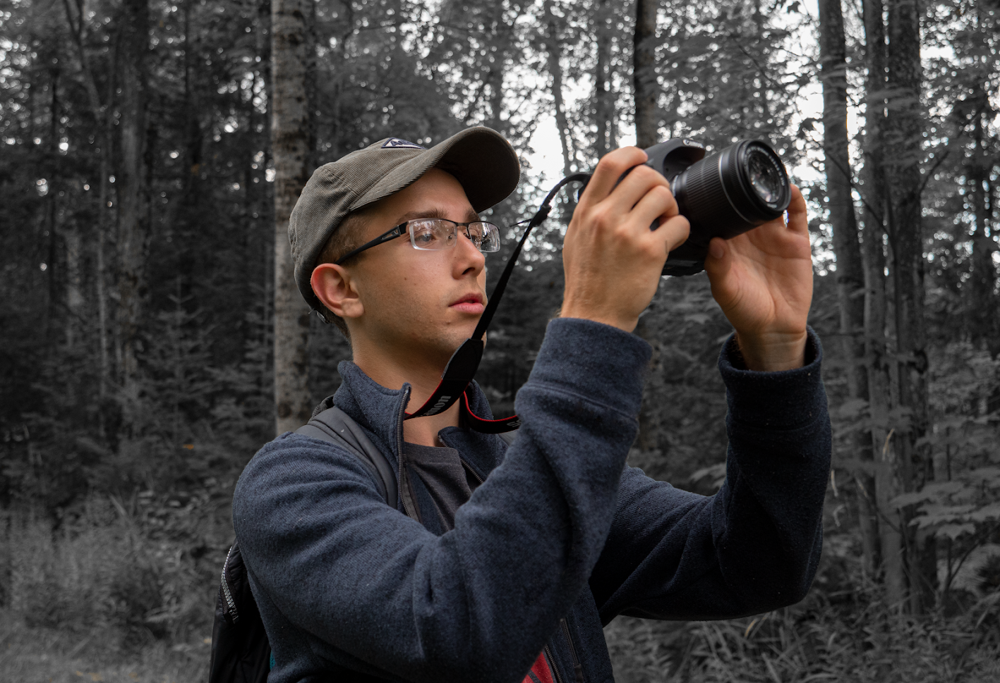

My name is Josiah Henson, and I am a Computer Science student studying at the University of Windsor. I'm passionate about technology, music, and physical fitness. I love reading books, playing soccer, and experimenting with technology. If I'm not on a field or in the gym, I'm inside reading a [book](https://www.goodreads.com/mantecademani) or hacking away at the next project idea in my head. I want to share the things I'm passionate about through this blog, so if any of these things inspire you please feel free to [reach out to me](mailto:josiahj.h@outlook.com).

---

My resume is listed down below, and is available as a pdf [here](other/josiahhenson-resume2020-09-11.pdf).

> Last updated September 11, 2020.

# Work Experience
## Laborer
### SUPERIOR MAPLE — JULY 2018 – AUG. 2018
Responsible for various physical labor tasks, including:
- Loading tools and materials onto vehicles
- Cleaning and cutting brush under lines to prevent damage and make maintenance easier
- Maintaining sap lines, cleaning lines, and replacing damaged taps
- Running new lines to increase sap intake

## Website Designer/Developer
### SUPERIOR MAPLE — MAR. 2018 – APR. 2018
Created the website for Superior Maple in its entirety from scratch. Designed it and iterated based on feedback from the company, and publishing before a deadline. Also updated the site when changes were required.
### Tools Used
- HTML
- CSS
- Figma

# Volunteer Experience
## Slideshow Runner
### BETHANY BAPTIST — OCT. 2015 - PRESENT
Responsible for creating and presenting slideshows for a recurring church event, and later transitioned into coordinating the use of PowerPoint, VLC, and YouTube during sermons.
Librarian

## Librarian
### BETHANY BAPTIST — DEC. 2014 - PRESENT
Assisted patrons with checking out books, maintaining the library, and being sociable with patrons to promote a welcoming environment.

# Skills
## Languages
- English
- Spanish

## Software
- Experience taking and editing pictures to correct lighting mistakes in Adobe Lightroom and Photoshop

# Education
## Computer Science – University of Windsor
### SEPT. 2020 – 2024
Currently enrolled in Computer Science online at the University of Windsor.

## High School – Korah C&VS
### SEPT. 2016 – JUNE 2020
In the enhanced learning stream in grades 9&10 and continued into IB in grades 11&12. Played Soccer 2 years and Track & Field. Played in the Concert Band for 3 years and in the Pit Band for both The Little Mermaid and The Sound of Music.

# Awards and Achievements
## MasseyHacks VI Hackathon
### MAY 30 – MAY 31, 2020
Created a game with a group of 3 other people in 24 hours using the Unity engine in C#. Source code available on GitHub.

## Awards
- Korah High Honours (4 years)
- IB Computer Science Award
- Concert Band Directors Award
